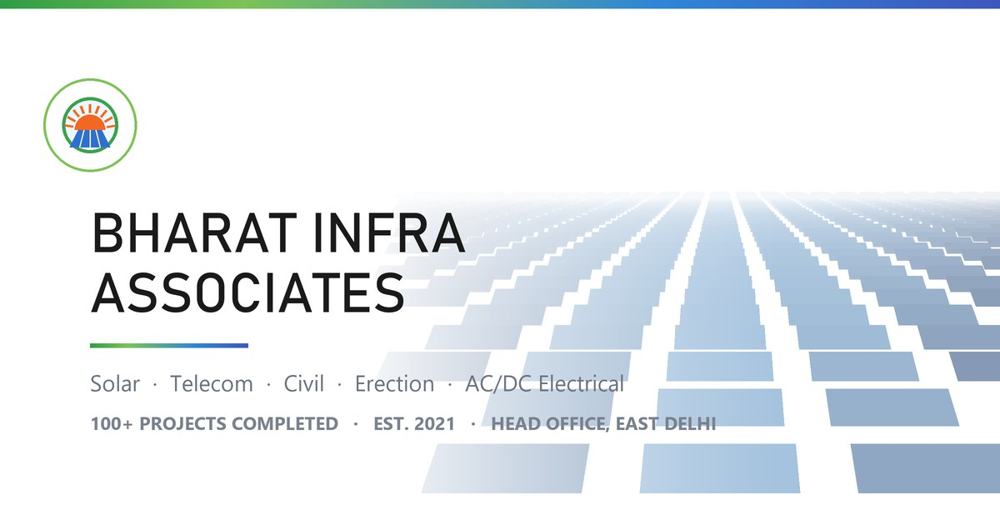

<!-- ========================= HERO / HEADER ========================= -->
<div align="center">



<h1>Bharat Infra Associates</h1>

<p><b><i>&ldquo;All Types Solar Project&rdquo;</i></b><br>
Solar&nbsp;&nbsp;|&nbsp;&nbsp;Telecom&nbsp;&nbsp;|&nbsp;&nbsp;Civil&nbsp;&nbsp;|&nbsp;&nbsp;Erection&nbsp;&nbsp;|&nbsp;&nbsp;AC/DC Electrical&nbsp;&nbsp;|&nbsp;&nbsp;O&amp;M</p>

<p>
<a href="https://www.bharatinfrassociate.com/"></a>
<a href="https://bharat-infra-associates.vercel.app/"></a>
<a href="tel:+919818742322"></a>
<a href="mailto:procurement@bharatinfrassociate.com"></a>
</p>

<p>


</p>

<!-- ============================ NAV BAR ============================ -->
<h4>
<a href="#overview">Overview</a> &nbsp;•&nbsp;
<a href="#services">Services</a> &nbsp;•&nbsp;
<a href="#why-us">Why Us</a> &nbsp;•&nbsp;
<a href="#tech-stack">Tech Stack</a> &nbsp;•&nbsp;
<a href="#getting-started">Getting Started</a> &nbsp;•&nbsp;
<a href="#project-structure">Structure</a> &nbsp;•&nbsp;
<a href="#deployment">Deployment</a> &nbsp;•&nbsp;
<a href="#contact">Contact</a>
</h4>

</div>

---

## Overview

**Bharat Infra Associates (BIA)** is a service-provider company working across the **solar, telecom and construction** sectors. Established in **2021** and headquartered in **East Delhi**, its listed services include civil foundations, structure erection, AC/DC electrical work, testing, commissioning and O&amp;M. The supplied company information identifies operations in Bihar and Jharkhand.

This repository holds the **official company website**: a fast, dependency-free, mobile-first single-page site with SEO structured data, an Open Graph card, a web manifest and a sitemap.

<table>
<tr>
<td align="center"><b>2021</b><br>Established</td>
<td align="center"><b>Bihar &amp; Jharkhand</b><br>Operating Experience</td>
</tr>
</table>

---

## Services

<table>
<tr>
<td width="33%" valign="top">

### Solar Projects
Ground-mount &amp; rooftop plants, module mounting structures, string and inverter works, testing and commissioning.

</td>
<td width="33%" valign="top">

### Civil Works
Excavation, PCC &amp; RCC foundations, equipment plinths, trenching, boundary walls, roads and drainage.

</td>
<td width="33%" valign="top">

### Erection
Lattice &amp; monopole tower erection, heavy structure lifting and alignment, torque control and grouting.

</td>
</tr>
<tr>
<td valign="top">

### AC / DC Electrical
DC string cabling, combiner boxes, AC LT panels and terminations, earthing and lightning protection.

</td>
<td valign="top">

### Telecom Infrastructure
Tower civil and erection, antenna mounting, OFC trenching and splicing, network build and integration.

</td>
<td valign="top">

### Asset Management &amp; O&amp;M
Preventive and breakdown maintenance, module cleaning and thermography, performance reporting.

</td>
</tr>
</table>

---

<!-- TODO: Confirm project counts, team structure, geographic reach, safety documentation and contracting model before publishing performance claims. -->

## Tech Stack

<p>


</p>

- **Zero dependencies** &mdash; one self-contained `index.html`, no frameworks, no build tools.
- **Responsive &amp; accessible** &mdash; fluid layout with light/dark `theme-color` support.
- **SEO ready** &mdash; canonical URL, meta description, Open Graph, Twitter card and `schema.org` JSON-LD graph.
- **Installable** &mdash; `site.webmanifest` plus maskable and Apple touch icons.
- **Crawler friendly** &mdash; `robots.txt` and `sitemap.xml` included.

---

## Getting Started

No installation, no package manager &mdash; just clone and open.

```bash
# 1. Clone the repository
git clone https://github.com/sanjeev125789632-cmd/Bharat-Infra-Associates.git
cd Bharat-Infra-Associates

# 2. Open directly in a browser
start index.html      # Windows
# open index.html     # macOS

# 3. Or serve it locally (recommended, so manifest & icons resolve)
python -m http.server 5173
# then visit http://localhost:5173
```

> **Tip:** edit `index.html` and refresh the browser &mdash; that is the entire development loop.

---

## Project Structure

```text
Bharat-Infra-Associates/
├── index.html               # Entire website: markup, styles, scripts, JSON-LD
├── site.webmanifest         # PWA manifest (name, colours, icons)
├── robots.txt               # Crawler rules
├── sitemap.xml              # URL list for search engines
├── og-image.jpg             # 1200x630 social share card
├── BIA_page-0001.jpg        # Company profile / brochure page
├── apple-touch-icon.png     # iOS home-screen icon
├── icon-192.png             # PWA icon (192x192)
├── icon-512.png             # PWA icon (512x512)
├── icon-maskable-512.png    # Maskable PWA icon
└── README.md                # This page
```

---

## Deployment

The site is deployed on **Vercel** and served from the company domain.

| Environment | URL | Status |
|:--|:--|:--:|
| Production | [www.bharatinfrassociate.com](https://www.bharatinfrassociate.com/) | Live |
| Preview | [bharat-infra-associates.vercel.app](https://bharat-infra-associates.vercel.app/) | Live |

<details>
<summary><b>Deploy your own copy</b></summary>

<br>

1. Fork or clone this repository.
2. Import the project into Vercel, Netlify or GitHub Pages &mdash; **no build command** is needed, the output directory is the repository root.
3. Update the canonical URL, Open Graph URLs and `sitemap.xml` entries to your own domain.
4. Replace `og-image.jpg` and the icon set with your own branding.

</details>

<details>
<summary><b>Contributing</b></summary>

<br>

Suggestions and fixes are welcome: open an issue, or fork the repo, create a branch (`feature/your-change`), commit and raise a pull request describing the change.

</details>

---

## Contact

<table>
<tr><td><b>Company</b></td><td>Bharat Infra Associates (BIA)</td></tr>
<tr><td><b>Managing Director</b></td><td>Bundan Khan</td></tr>
<tr><td><b>Head Office</b></td><td>B-49, 3rd Floor, Mehtab Complex, Joshi Colony, IP Extension, Delhi 110092, India</td></tr>
<tr><td><b>Phone</b></td><td><a href="tel:+919818742322">+91 98187 42322</a></td></tr>
<tr><td><b>Email</b></td><td><a href="mailto:procurement@bharatinfrassociate.com">procurement@bharatinfrassociate.com</a></td></tr>
<tr><td><b>Website</b></td><td><a href="https://www.bharatinfrassociate.com/">www.bharatinfrassociate.com</a></td></tr>
<tr><td><b>Languages</b></td><td>English, Hindi</td></tr>
</table>

---

<!-- ============================== FOOTER ============================== -->
<div align="center">

### Bharat Infra Associates
Solar &bull; Telecom &bull; Civil &bull; Erection &bull; Electrical &bull; O&amp;M

<a href="#overview">Back to top &uarr;</a>

<sub>© 2026 Bharat Infra Associates. All rights reserved.<br>
Built and maintained with care in Delhi, India.</sub>

</div>
